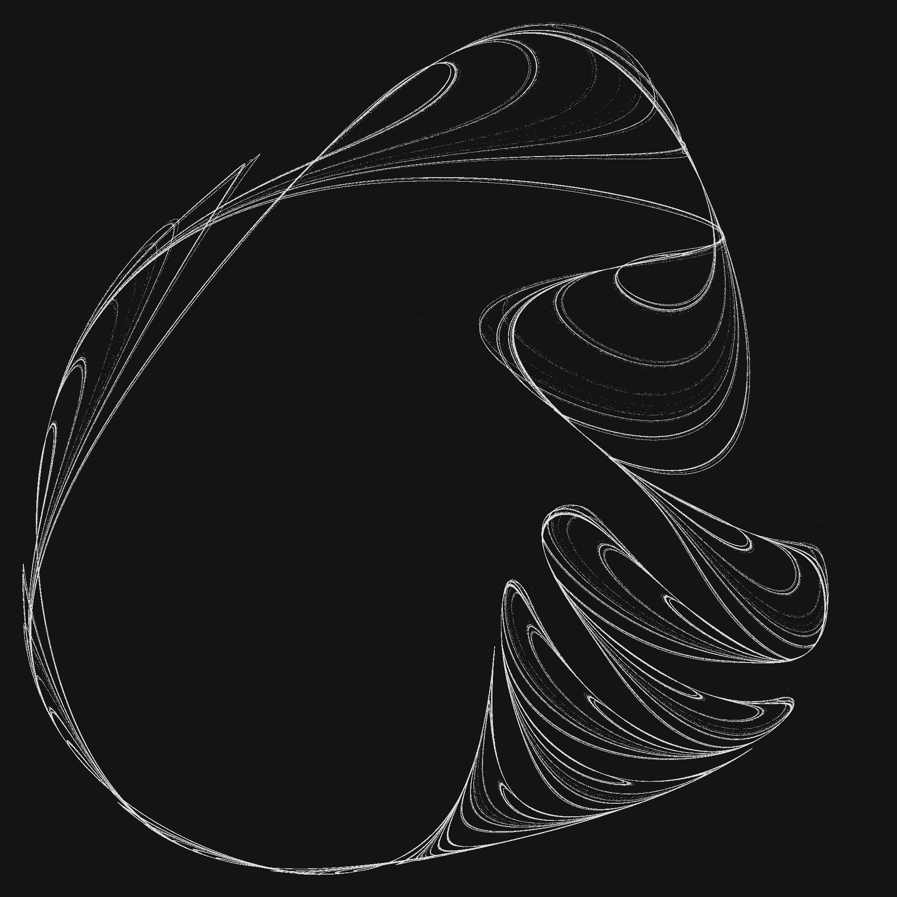
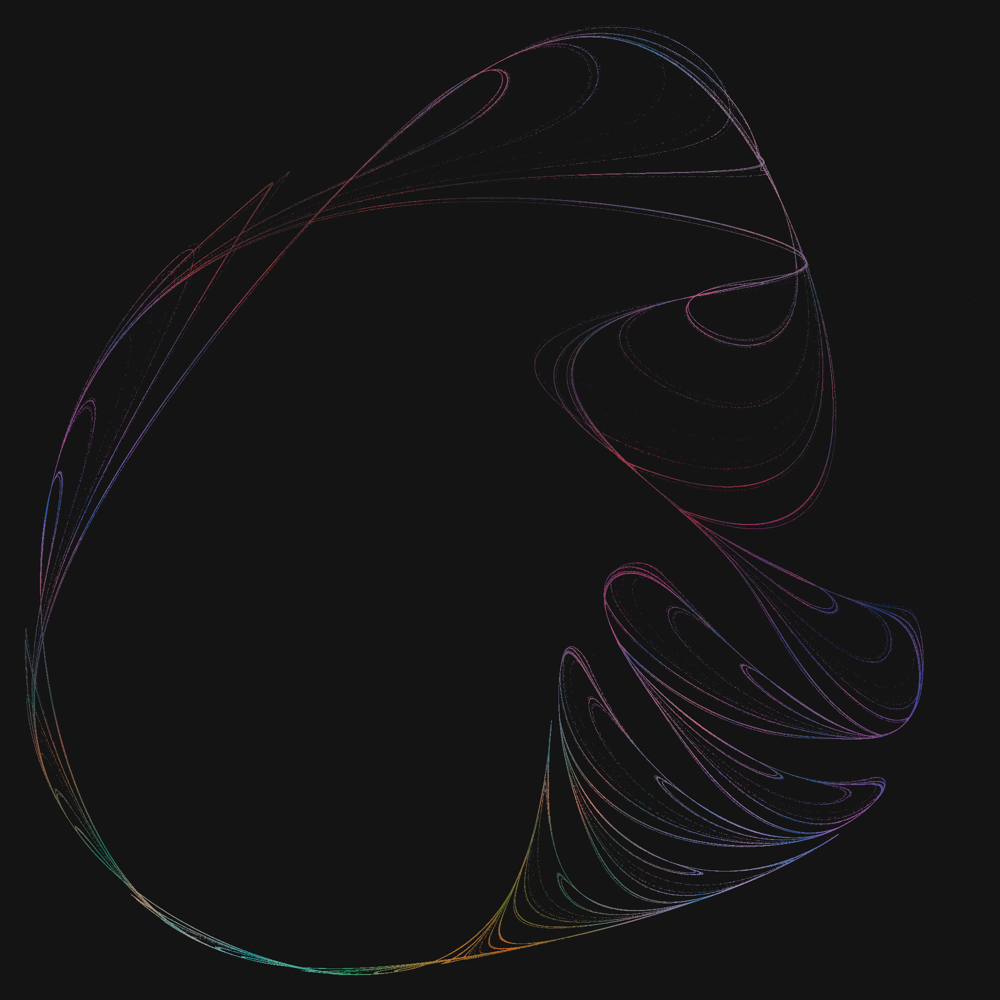
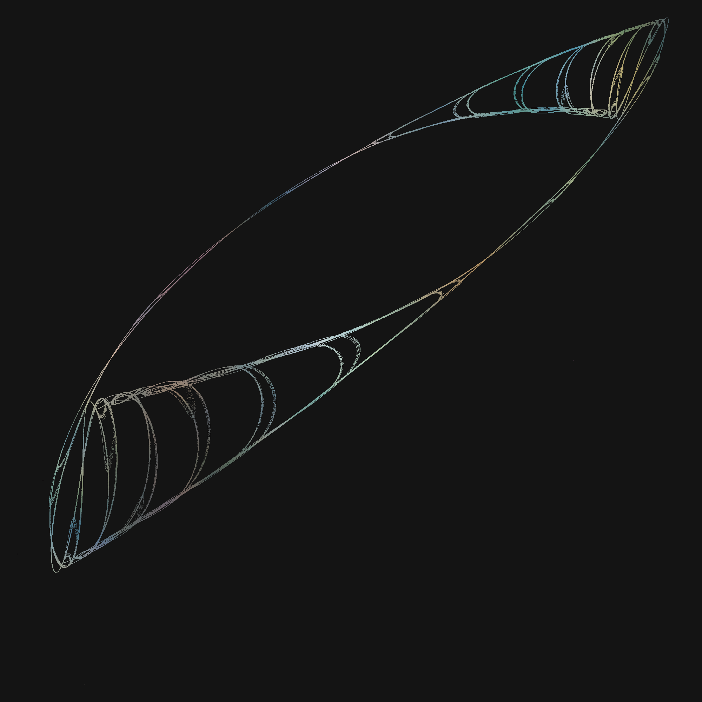
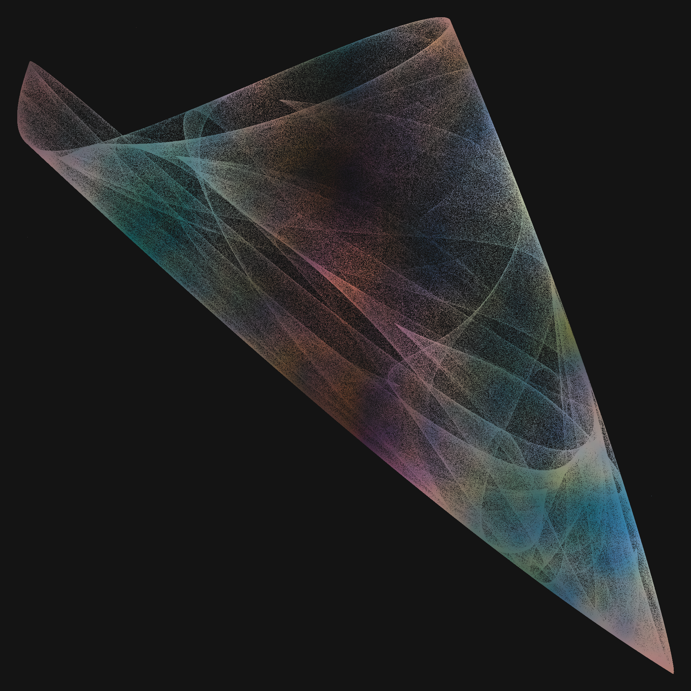

# Strange Attractor 

<p align="center">
 
 
</p>

<p align="center">
 
 
</p>


#### Inspiration

This project is based on [this](https://youtu.be/AzdpM-vfUCQ?si=XzwipangHxHjBUcX) video series by [Coding Cassowary](https://x.com/cassowarycoding) and is inspired by [Paul Bourke](https://paulbourke.net/fractals/lyapunov/)'s fantastic blog.


---


A mixture of python scripts to conveniently create numerous random strange attractors with python scripts while utilizing the effectiveness of C++. You can quickly test random parameters and then further calculate the ones you like!


## Simple execution

1. **Find multiple attractors**:<br>

Call `python3 1_find_multiple_attractors.py`. You will be prompted to enter a `name`, `number of attractors` to find and the `steps` that each attractor should be calculated for. Afterwards, you will find [matplotlib](https://matplotlib.org/) visualizations in the subdirectory `data/[name]/plots`. <br>
Alternatively you can pass these parameters directly. E.g.

```python
python3 1_find_multiple_attractors.py foo 3 10000
```
would create the subdirectory `data/foo` with 3 different attractors, that each were evaluated for $10^4$ data points.


2. **Adding more points and processing drawing**:<br>

`2_expand_one_attractor.py` will prompt you for a directory `name`, the specific `index` you want to further develop and the number of `steps`. E.g.

```python
python3 2_expand_one_attractor.py foo 1 1000000
```
will find $10^6$ more points for the attractor that corresponds to index $1$ for the project `foo`. Additionally, a processing visualization is stored in `data/foo/py5_plots`.<br>
Furthermore, you can change between b/w and noise-colors with the `colorful` parameter in `2_expand_one_attractor.py`. `plot_only=True` can be used if you want to forgo generating data points. 


## Write your own functions

1. Define your own 2D system of equation in `function.cc`.
2. Adjust the constant `N_COEFFICIENTS` in `function.h`.
3. Recompile with 

```shell
g++ cpp-scripts/attractor-calculation.cc function.cc -o cpp-scripts/attractor-calculation
```
```shell
g++ cpp-scripts/extensive-attractor-calculation.cc function.cc -o cpp-scripts/extensive-attractor-calculation
```
or set `recompile=True` in both python scripts.


## Directory Overview

```tree
strange-attractors
│
├── 1_find_multiple_attractors.py
├── 2_expand_one_attractor.py
│
├── function.cc
├── function.h
│
├── data
│   │
│   ├── foo
│   │   ├── coeffs
│   │   │   ├── 0.txt
│   │   │   ├── 1.txt
│   │   │   └── 2.txt
│   │   ├── plots
│   │   │   ├── 0.jpg
│   │   │   ├── 1.jpg
│   │   │   ├── 1exp.jpg
│   │   │   └── 2.jpg
│   │   ├── points
│   │   │   ├── 0.txt
│   │   │   ├── 1.txt
│   │   │   ├── 1exp.txt
│   │   │   └── 2.txt
│   │   └── py5_plots
│   │       └── 1.png
│   │
│   └── bar
│       └── ...
│
├── cpp-scripts
│   └── ...
│
└── ...

```
